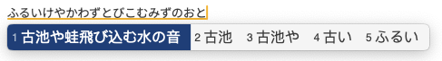

[日本語](README.md)
# 简介
基于Rime实现的日语输入方案

# 特点
- 使用[Project Mozc](https://github.com/google/mozc)的词典及连接矩阵数据
- 使用Viterbi算法对假名序列进行转换
- 內置罗马字、假名布局，也可以自行依据这些配置轻松地加入其他布局
- 支持实时或者在kagiroi.dict.yaml里添加自定义词汇
- 支持使用自然码辅码进行辅助筛选，参见 [℞ rime-mkm](https://github.com/rimeinn/rime-mkm)

# 安装
℞ `rimeinn/rime-kagiroi`

# 用例

> 💡
> 请移步至本项目的 [wiki页](https://github.com/rimeinn/rime-kagiroi/wiki) 获得详细的使用说明

# 依赖
- librime >= 1.11.2
- librime-lua plugin

# 协议
本项目基于 GPLv3 开源

Mozc词典相关的开源协议参见
[这里](https://github.com/google/mozc/blob/006ed69bf545548a8a3596b13f58cb22cf3d8a2f/src/data/dictionary_oss/README.txt)

# 参考项目
- [Mozc: a Japanese Input Method Editor designed for multi-platform](https://github.com/google/mozc)
- [MeCab: Yet Another Part-of-Speech and Morphological Analyzer](https://taku910.github.io/mecab/)
- [Mozc for Python: Kana-Kanji converter](https://github.com/ikegami-yukino/mozcpy)
